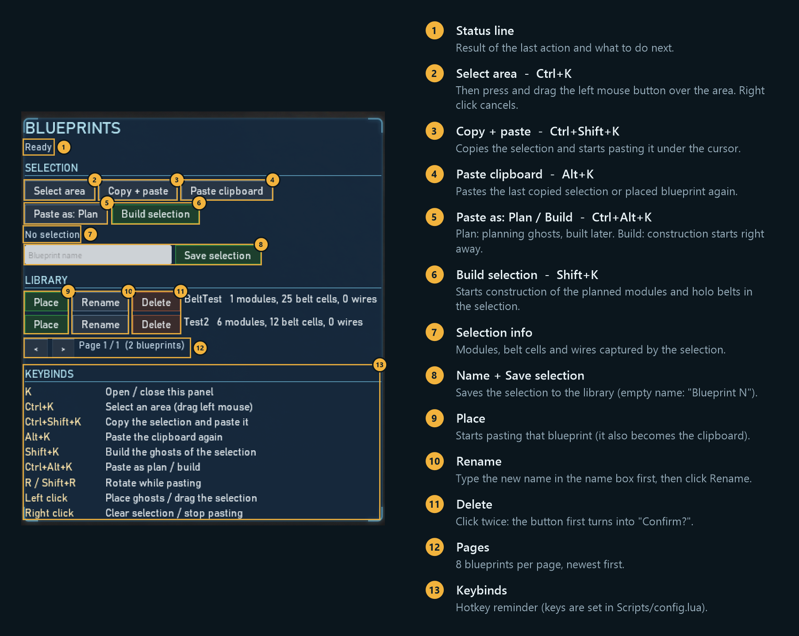

# The Crust Mods

Mods for [The Crust](https://store.steampowered.com/app/1465470/The_Crust/) (Unreal Engine 4.27),
mostly Lua mods running on [UE4SS](https://github.com/UE4SS-RE/RE-UE4SS), plus the modding toolkit and research notes
used to build them.

<a href="https://www.buymeacoffee.com/litpixi"></a>
<a href="https://ko-fi.com/litpixi"></a>

| Mod | What it does | Download |
|-----|--------------|----------|
| [Blueprints](#blueprints) | Copy / paste areas of your base and save them as reusable blueprints | [TheCrust-Blueprints.zip](https://github.com/OmiCron07/TheCrust-Mods/releases/latest/download/TheCrust-Blueprints.zip) |
| [ZoomToCursor](#zoomtocursor) | Mouse wheel zooms toward the cursor instead of the screen center | [TheCrust-ZoomToCursor.zip](https://github.com/OmiCron07/TheCrust-Mods/releases/latest/download/TheCrust-ZoomToCursor.zip) |
| [SkipIntro](#skipintro) | Skips the startup logo videos (story cinematics kept), no UE4SS needed | [TheCrust-SkipIntro.zip](https://github.com/OmiCron07/TheCrust-Mods/releases/latest/download/TheCrust-SkipIntro.zip) |
| All mods | All the mods above in one zip | [TheCrust-AllMods.zip](https://github.com/OmiCron07/TheCrust-Mods/releases/latest/download/TheCrust-AllMods.zip) |

All releases: [Releases](https://github.com/OmiCron07/TheCrust-Mods/releases).

## Installation

### 1. Install UE4SS (once, for the Lua mods)
Not needed for SkipIntro alone.

1. Download UE4SS v3 from the [RE-UE4SS releases](https://github.com/UE4SS-RE/RE-UE4SS/releases)
   (the mods are tested with v3.0.2, from the `experimental-latest` release: take `UE4SS_v3.x.zip`, not
   the `zDEV` one).
2. Open the game folder: `Steam > Library > The Crust > right click > Manage > Browse local files`.
   It is the folder containing `TheCrust`, e.g. `C:\Program Files (x86)\Steam\steamapps\common\The Crust`.
3. Extract the UE4SS zip into `TheCrust\Binaries\Win64` (`dwmapi.dll` must sit next to
   `TheCrust-Win64-Shipping.exe`).

### 2. Install the mods
1. Download the zip of a mod (or the all-mods zip) from the table above.
2. Extract it into the game folder (the one containing `TheCrust`) and accept to merge folders.
   The zip already has the right layout:
   ```
   The Crust\
   ├── INSTALL-<Mod>.txt                      (instructions, can be deleted)
   └── TheCrust\
       ├── Binaries\Win64\ue4ss\Mods\<Mod>\     (Lua mods)
       │   ├── enabled.txt                    (makes UE4SS load the mod, no mods.txt edit needed)
       │   └── Scripts\*.lua
       └── Content\Movies\*.mp4               (SkipIntro, overwrites the startup videos)
   ```
3. Start the game.

### Update
Quit the game, then extract the new zip the same way. This overwrites `Scripts\config.lua`: back it up
first if you customized it. The Blueprints library (`library.lua`) is not in the zip and is kept.
A game update or a Steam file verification restores the original startup videos: extract
`TheCrust-SkipIntro.zip` again afterwards.

### Uninstall
Delete `TheCrust\Binaries\Win64\ue4ss\Mods\<Mod>`. To only disable a mod, delete its `enabled.txt`
(and make sure `ue4ss\Mods\mods.txt` does not list `<Mod> : 1`).
SkipIntro: `Steam > Library > The Crust > right click > Properties > Installed Files > Verify integrity
of game files` restores the original videos.

## Mods

### Blueprints
Select an area, copy/paste it or save it as a reusable blueprint. Pasting places vanilla planning
ghosts: modules with their rotation, mirroring and production scheme, holo conveyor belts and the
electric wires between pasted modules. Build them afterwards with the normal game buttons, or all at
once with **Build selection**.



| Key | Action |
|-----|--------|
| `K` | Open / close the blueprint manager panel (library: save, place, rename, delete) |
| `Ctrl+K` | Select an area (drag with the left mouse button) |
| `Ctrl+Shift+K` | Copy the selection and start pasting it |
| `Alt+K` | Paste the clipboard again |
| `Shift+K` | Start construction of the planned modules and holo belts in the selection |
| `Ctrl+Alt+K` | Switch pasting between planning ghosts and direct construction |
| `R` / `Shift+R` | While pasting: rotate clockwise / counter clockwise |
| Left / right click | While pasting: place the ghosts / cancel |

Distributors and module IO cell settings (filters, priorities, locks, overflow, IO swaps) are
copied too. Not supported yet: underground belts, storage limits. Hotkeys and options are in `Scripts\config.lua`.
Full documentation: [Mods/Blueprints/README.md](Mods/Blueprints/README.md).

### ZoomToCursor
Scrolling the mouse wheel zooms toward the world point under the cursor (like Factorio or Anno)
instead of the screen center.

- Zoom in to the cursor (on by default), zoom out from the cursor (off by default, vanilla center).
- Underground max zoom distance raised from 4200 to 10000 (configurable); surface limit unchanged.
- WASD friendly: while the camera moves with the keyboard, zoom stays vanilla.
- Options in `Scripts\config.lua`: `ZoomInToCursor`, `ZoomOutFromCursor`, `ZoomStrengthMultiplier`,
  `UndergroundMaxZoom`, `ClampToMapBounds`, `DebugLogging`.

Full documentation: [Mods/ZoomToCursor/README.md](Mods/ZoomToCursor/README.md).

### SkipIntro
Replaces the three startup videos (Unreal Engine logo, publisher and developer logos, title reveal) in
`TheCrust\Content\Movies` with a 0.04 s blank video, so the game reaches the main menu faster. The
campaign intro cinematics are not touched. The `-nomovies` launch option does not work for this game.

Full documentation: [Mods/SkipIntro/README.md](Mods/SkipIntro/README.md).

## Troubleshooting
- Nothing happens in game: check `TheCrust\Binaries\Win64\ue4ss\UE4SS.log` for the
  `Mod '<Mod>' has enabled.txt, starting mod.` line and Lua errors.
- Quit the game before installing or updating a mod: the UE4SS hot reload of these mods can crash the game.

## Support
If these mods save you some time, you can support their development:
- [Buy Me a Coffee](https://www.buymeacoffee.com/litpixi)
- [Ko-fi](https://ko-fi.com/litpixi)

## Development
- `Mods/`: mod sources. A folder with `Scripts/main.lua` is a Lua mod; a folder with a `TheCrust/`
  subfolder ships that tree as is (game files mod). `DevBridge` is a development tool, never released.
- `Scripts/`: PowerShell tooling (UE4SS setup, deploy, pak tools, `Build-ModRelease.ps1`).
- `Knowledge/`: research notes and playbooks ([OKF](https://github.com/okfcli/okf) bundle).

Deploy a mod from the repo into a local game install:
```pwsh
.\Scripts\Deploy-Lua-Mod.ps1 -ModSourceDir ".\Mods\Blueprints"
```

Build the release zips locally (output in `dist/`):
```pwsh
.\Scripts\Build-ModRelease.ps1
```

### Release pipeline
[`.github/workflows/release-mods.yml`](.github/workflows/release-mods.yml) runs on every push to `main`
that changes shipped mod files (Markdown files and `Mods/DevBridge` are ignored), or manually from the
Actions tab. It builds one zip per mod (every `Mods/*` folder except `DevBridge`) plus `TheCrust-AllMods.zip` and publishes them as a new GitHub
release marked as latest, so the download links above always point to the newest build.
